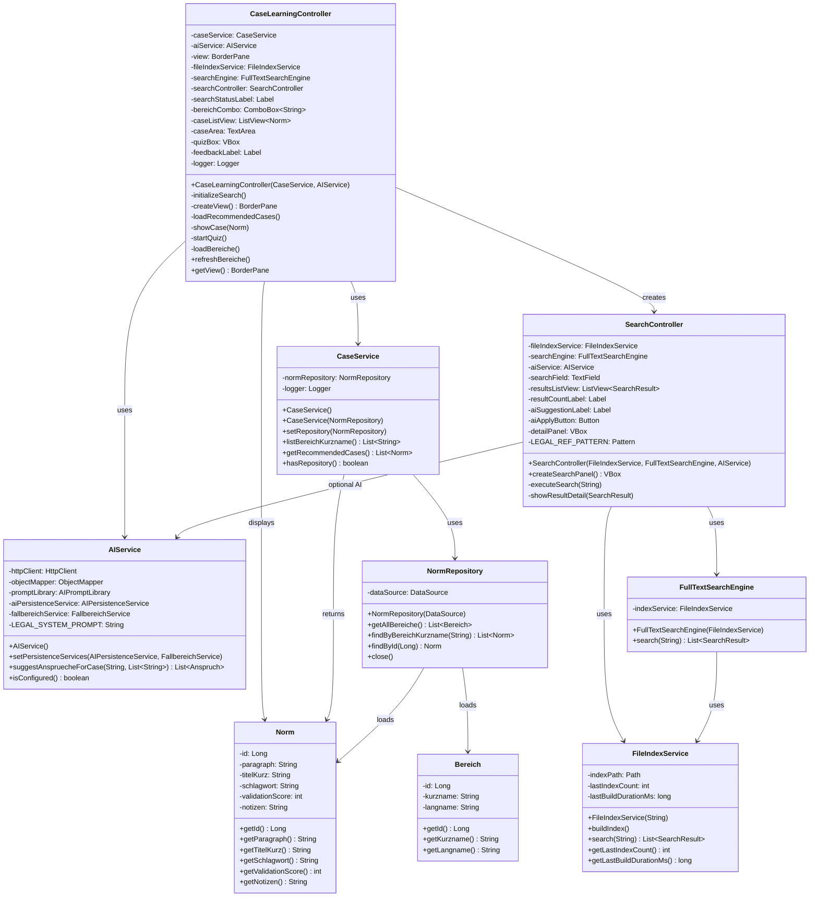
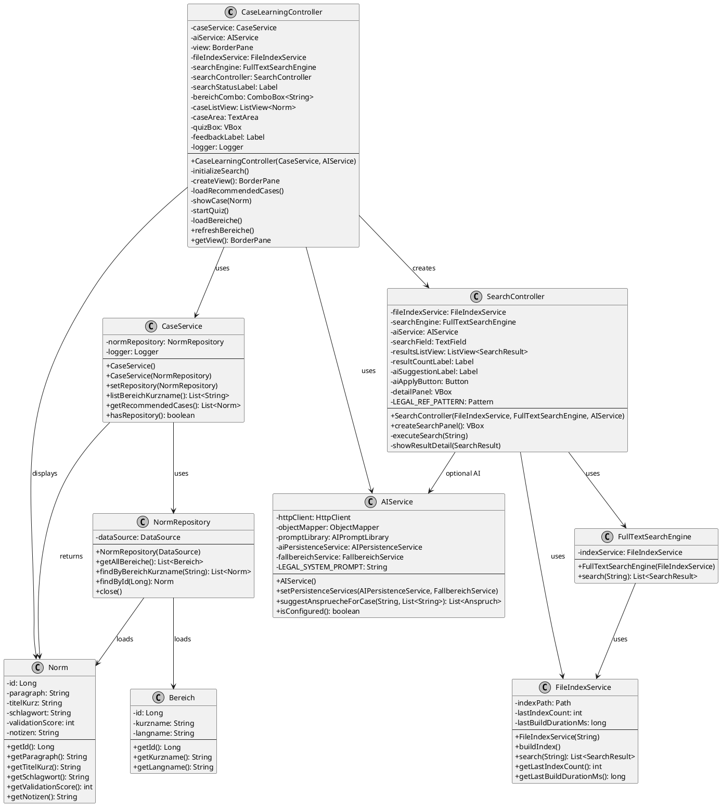

# Cases Tab – UML-Klassendiagramm

## Mermaid-Diagramm (copy-paste-fähig)

---

## PlantUML-Diagramm (copy-paste-fähig)

---

## Erläuterungen

- **CaseLearningController** ist der Haupt-Controller für den Tab “Cases”. Er baut die UI programmatisch (BorderPane), lädt Fälle über `CaseService`, und bindet eine `SearchController`-Komponente ein.
- **CaseService** bietet eine Abstraktion über `NormRepository`. Er liefert Listen von Normen/Fällen und Bereiche (für die ComboBox).
- **AIService** wird optional an `SearchController` übergeben. Er kann für KI-gestützte Query-Verbesserungen genutzt werden.
- **SearchController** rendert eine Volltextsuche über `FileIndexService`/`FullTextSearchEngine`. Er kann in beliebige UIs (hier Cases Tab) eingebettet werden.
- **FileIndexService** & **FullTextSearchEngine** bilden die Such-Infrastruktur (Index + Volltextsuche).
- **Norm**, **NormRepository**, **Bereich** sind die Domänen-Modelle und Repositories, die von `CaseService` genutzt werden.

---

## Hinweise zur Visualisierung

- **Mermaid** kann direkt in GitHub/GitLab Markdown, VS Code, oder Tools wie Mermaid Live Editor gerendert werden.
- **PlantUML** kann mit IntelliJ, Eclipse, VS Code (Extension), oder Online-PlantUML-Server gerendert werden.
- Beide Diagramme sind **copy-paste-fähig** und können bei Bedarf leicht erweitert werden (z.B. um weitere UI-Komponenten oder Service-Methoden).
